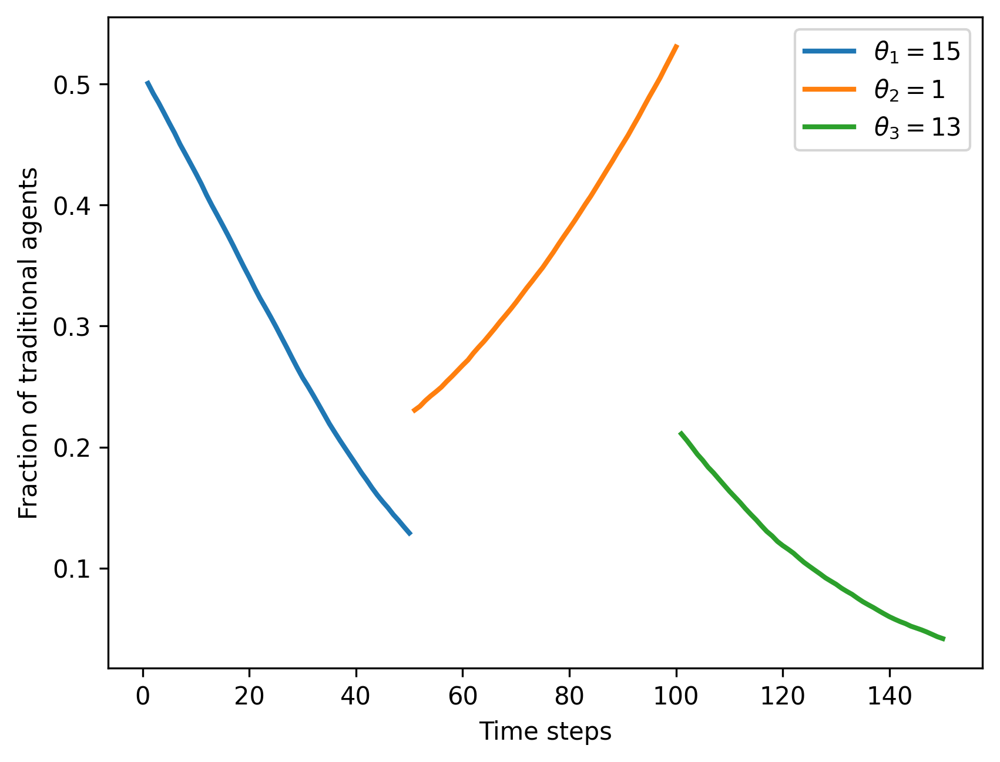
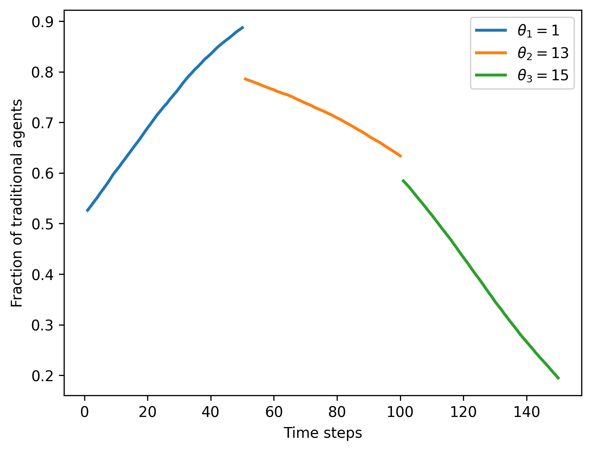

# institution-design
The official repository for the institution design project. It contains the simulation engine, reproducible notebooks, and saved outputs needed to explore institutional dynamics across different enforcement thresholds (`theta`).

## Repository structure

```
.
├── main.py                 # CLI entry point that wires parameters and runs Simulation
├── src/
│   ├── agent.py            # Agent representation
│   ├── game.py             # Core game / update loop
│   ├── simulation.py       # High-level orchestration + persistence
│   └── utils.py            # Filename helpers, shared utilities
├── docs/
│   ├── gameDesign.md             # Design notes on the institutional game
│   └── saved_data_structure.md   # Detailed description of saved pickle format
├── notebooks/
│   ├── analysis.ipynb            # Post-processing + visualization notebook
│   └── all_in_one.ipynb          # Batch workflow for combined analyses
├── results/
│   ├── data/               # Pickled simulation runs (auto-created)
│   └── figs/               # Figures exported from notebooks
└── README.md
```

## Running the simulation with uv

1. Install [uv](https://docs.astral.sh/uv/getting-started/installation/) (e.g., `curl -LsSf https://astral.sh/uv/install.sh | sh`).
2. From the project root, install the project dependencies:

   ```bash
   uv sync
   ```

3. Run the simulation entry point:

   ```bash
   uv run main.py
   ```

   The default parameters are defined in `main.py`. Update them there or expose your own CLI wrapper if you need user-provided inputs. The run writes a pickle file to `results/data/` (see `docs/saved_data_structure.md` for the schema).

## Generating and storing figures

1. Ensure at least one simulation pickle exists under `results/data/`.
2. Open `notebooks/analysis.ipynb` in Jupyter (e.g., `uv run jupyter lab`).
3. Update the notebook cell that points to the desired pickle filename, run all cells, and use the provided helper functions to export plots.
4. Plots are saved automatically to `results/figs/`. Keep filenames descriptive (e.g., encode theta order) so they can be referenced from reports or this README.

### Sample figures

Below are two representative outputs rendered from `analysis.ipynb` (stored in `results/figs/`).





